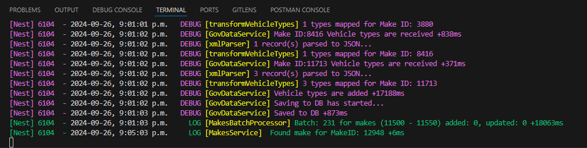
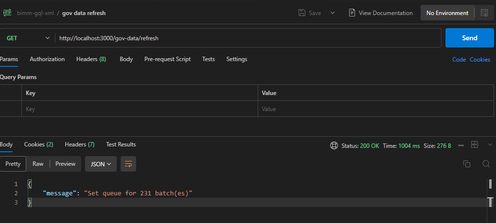

> :point_right: This is NOT a production code, adjust for your needs before using.
> All db connection strings as well as url endpoints suggested to move to `.env` files for each environment

# Project: Parsing XML data for Vehicle Manufacturers

## Description

Fast, maintainable, and scalable app that can parse XML data, transform it to JSON format.
Data is saved in the persistant datastore (MongoDB) and can be accessed via GraphQL single endpoint.

## Tech stack used

Nest.js, Mongoose, MongoDB, Bull, Redis

# Key implementation details

1. Getting all makes information from public website by hitting
2. It starts refresh(add) records process.
3. Splitting approx. 11.5K records into batches by 50 records for getting additional info, parsing, transforming, and saving in DB (around 240 batches)
4. Queues to process each batch are running in the background with minimum affect on app performance
5. The GraphQL endpoint is accessible any time

## Project setup

```bash
$ npm install
```

## Preliminary requirements

You should have local copies on MongoDB and Redis running
if you done have one or both, please adjust docker-compose.yml file for your needs
and run

```bash
docker compose up
```

Make sure that Redis and MongoDB are available on localhost


For debuging it's good to have acces to Redis


## Compile and run the project

```bash
# development
$ npm run start

# watch mode
$ npm run start:dev
```

## Run tests

```bash
# unit tests
$ npm run test

# e2e tests
$ npm run test:e2e

# test coverage
$ npm run test:cov
```

## Linting

```bash
$ npm run lint
```

## Logging

For logging is used built-in Nest.js logger



## Grabbing the XML data

To start grabbing data from the public website, send get request with your favorite tool to

```
http://localhost:3000/gov-data/refresh
```

    

### Mock XML data

There is Mocks folder. It's here for the development purposes.
Time to time the main website is going down.
Please adjust the xmlString to this mock data

## Access GraphQL Playground

Go to

```
http://localhost:3000/graphql
```

And run requests as per your needs


## Docker image

Build

```bash
docker build -t bimm-gql-xml .
```

Run

```bash
docker run -p 3000:3000 bimm-gql-xml
```

## Support

The app code is mostly self-explanatory with a couple of comments for production

For Nest.js refer to [Nest.js website](https://docs.nestjs.com/)
